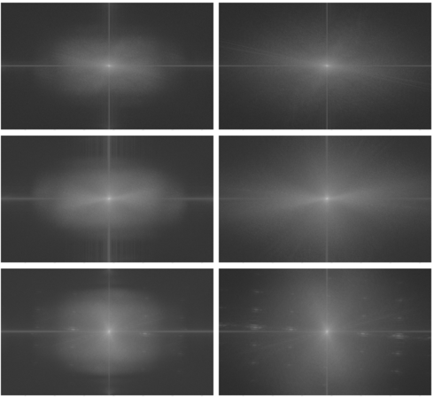

# video-fft

[](https://pypi.org/project/video-fft)

[](https://github.com/slhck/video-fft/actions/workflows/python-package.yml)

Calculate the magnitude spectrum of a video sequence, via Fast Fourier Transform, to detect the actual resolution.

**Contents:**

- [What this does](#what-this-does)
- [Requirements](#requirements)
- [Installation](#installation)
- [Usage](#usage)
- [API](#api)
- [Limitations](#limitations)
- [Acknowledgements](#acknowledgements)
- [License](#license)

## What this does

The package calculates the magnitude spectrum of each frame's luminance data.

This allows, for example, identifying upscaled parts of a video, such as when someone upscaled HD content to UHD. By analyzing the spectrum, you can see that the actual high frequencies that would be expected for "real" UHD content are not present, or not as present as you'd normally see.



The above example shows three sources (each source is one row), with the left image corresponding to the HD version of the source, upscaled to UHD, and the right image being the actual UHD source. The grey "boxes" in the left column tell you that the actual content is merely HD.

The package also outputs the azimuthally averaged 1D power spectrum, from which the high frequencies are extracted and summed up to give one "score" per frame.

## Requirements

- Python 3.9 or higher
- FFmpeg libraries (to run `pyav`)

Under Ubuntu, to get ffmpeg libraries:

```bash
sudo apt install libavformat-dev libavcodec-dev libavdevice-dev libavutil-dev libavfilter-dev libswscale-dev libavresample-dev
```

Under macOS, it is recommended to install ffmpeg via [Homebrew](https://brew.sh):

```bash
brew install ffmpeg
```

## Installation

Install with [`uv`](https://docs.astral.sh/uv/getting-started/installation/):

```bash
uvx video-fft
```

Or install with `pipx`:

```bash
pipx install video-fft
```

Or, with pip:

```bash
pip3 install --user video-fft
```

## Usage

To run it, simply call `video-fft` with the path to your video file:

```bash
video-fft /path/to/video.mp4
```

This will output a progress bar for each frame, and finally output the statistics as JSON.

You can enable output of magnitude spectrum images via three options:

- `-r`/`--first-frame`: Only output the first frame of the video
- `-a`/`--all-frames`: Output all frames
- `-m`/`--mean`: Output an averaged magnitude spectrum for all frames

The images will be saved next to the input file, unless you choose a different output path (via `-o`/`--output`).

For more info, see `video-fft -h`:

```
usage: video-fft [-h] [-o OUTPUT] [-n NUM_FRAMES] [-of {json,csv}] [-r] [-a] [-m] [-s SCALE] [-q] input

positional arguments:
  input                 Input video file

optional arguments:
  -h, --help            show this help message and exit
  -o OUTPUT, --output OUTPUT
                        Output path for the images, default: same as input video file (default: None)
  -n NUM_FRAMES, --num-frames NUM_FRAMES
                        Number of frames to calculate (default: None)
  -of {json,csv}, --output-format {json,csv}
                        Select output format (default: json)
  -r, --first-frame     Render image for radial profile of the first frame (default: False)
  -a, --all-frames      Render image for radial profile of all frames (default: False)
  -m, --mean            Render image for mean/average radial profile of the entire sequence (default: False)
  -s SCALE, --scale SCALE
                        Image scaling, adjust to increase/decrease rendered image size (default: 1)
  -q, --quiet           Do not show progress bar (default: False)
```

## API

The program exposes an API that you can use yourself:

```python
from video_fft import VideoFftCalculator

vid_fft = VideoFftCalculator(
    "input.mp4",
    output="/path/to/output"
)
vid_fft.calc_fft()
print(vid_fft.get_formatted_stats())
```

For more usage please read [the docs](https://htmlpreview.github.io/?https://github.com/slhck/video-fft/blob/master/docs/video_fft.html).

## Limitations

The absolute value of the FFT is not meaningful on its own and cannot be linked to the resolution of the input video. The plots also do not indicate any kind of resolution.

## Acknowledgements

This tool is based on initial work from Julian Zebelein and Steve Göring (TU Ilmenau).

The concept is based on the following paper: Katsavounidis, Ioannis, Anne Aaron, and David Ronca. "Native resolution detection of video sequences." SMPTE 2015 Annual Technical Conference And Exhibition. SMPTE, 2015.

## License

The MIT License (MIT)

Copyright (c) 2021-2023 Werner Robitza

Permission is hereby granted, free of charge, to any person obtaining a
copy of this software and associated documentation files (the
"Software"), to deal in the Software without restriction, including
without limitation the rights to use, copy, modify, merge, publish,
distribute, sublicense, and/or sell copies of the Software, and to
permit persons to whom the Software is furnished to do so, subject to
the following conditions:

The above copyright notice and this permission notice shall be included
in all copies or substantial portions of the Software.

THE SOFTWARE IS PROVIDED "AS IS", WITHOUT WARRANTY OF ANY KIND, EXPRESS
OR IMPLIED, INCLUDING BUT NOT LIMITED TO THE WARRANTIES OF
MERCHANTABILITY, FITNESS FOR A PARTICULAR PURPOSE AND NONINFRINGEMENT.
IN NO EVENT SHALL THE AUTHORS OR COPYRIGHT HOLDERS BE LIABLE FOR ANY
CLAIM, DAMAGES OR OTHER LIABILITY, WHETHER IN AN ACTION OF CONTRACT,
TORT OR OTHERWISE, ARISING FROM, OUT OF OR IN CONNECTION WITH THE
SOFTWARE OR THE USE OR OTHER DEALINGS IN THE SOFTWARE.
